# SEO Dashboard

올인원 SEO 분석 대시보드 - 사이트 크롤링, 키워드 순위 추적, AI 콘텐츠 최적화를 하나의 플랫폼에서 제공합니다.

**로그인 없이 누구나 즉시 SEO 진단 가능!** URL만 입력하면 웹사이트의 SEO 상태를 분석합니다.

## Screenshots

### SEO 진단 검사기 (공개 - 로그인 불필요)

#### 랜딩 페이지
URL을 입력하면 즉시 SEO 분석을 시작합니다. 로그인이 필요 없습니다.
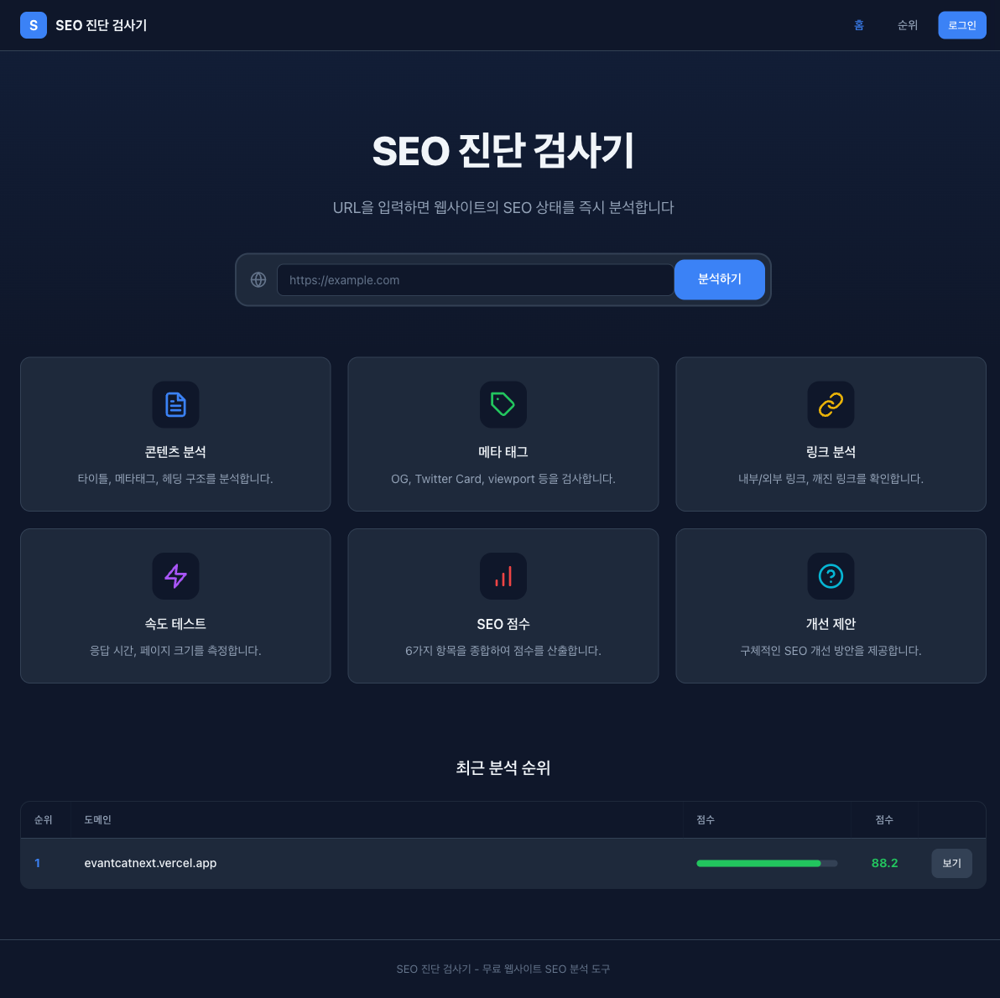

#### SEO 분석 결과 - eventcat
종합 점수, 메타태그, 체크리스트, 헤딩 구조, 링크, 성능, 개선사항을 한눈에 확인합니다.
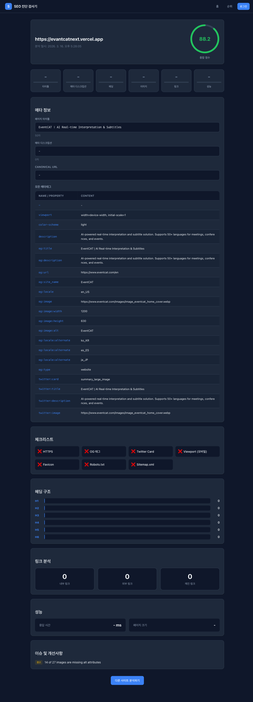

#### SEO 분석 결과 - naver.com
네이버 SEO 분석: 83점. 타이틀 길이 부족, 메타 디스크립션 짧음, H2 없음 등 이슈 감지.
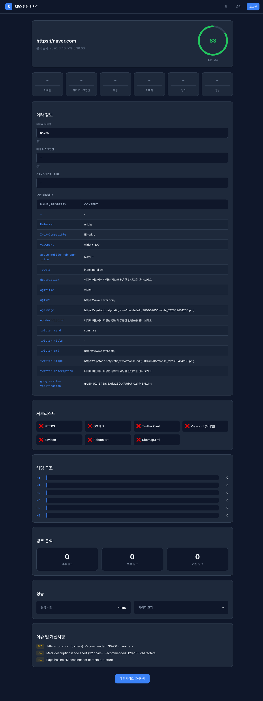

#### SEO 점수 순위표
분석된 사이트들의 SEO 점수 순위를 확인합니다.
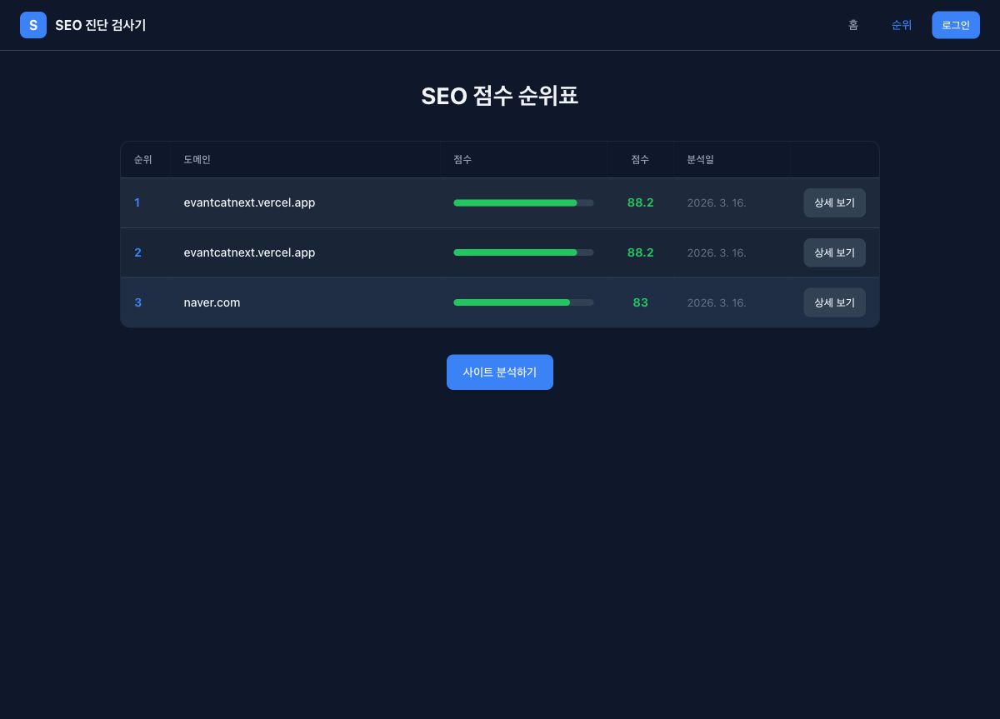

---

### 관리자 대시보드 (로그인 필요)

#### 로그인
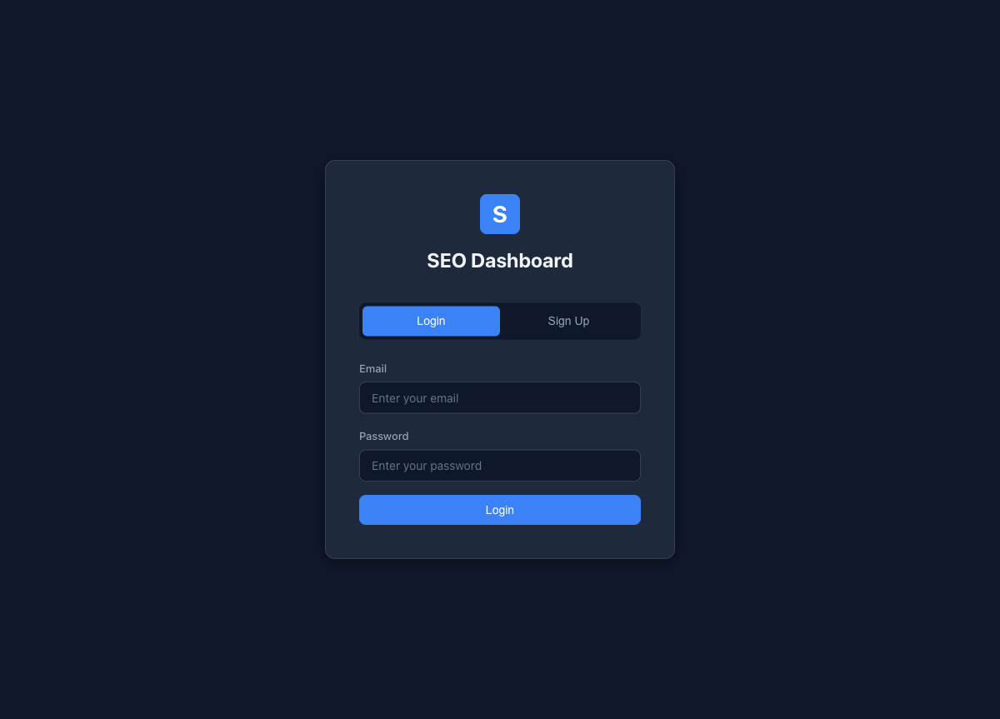

### 종합 대시보드
등록된 사이트의 SEO 점수, 키워드 현황을 한눈에 확인합니다.
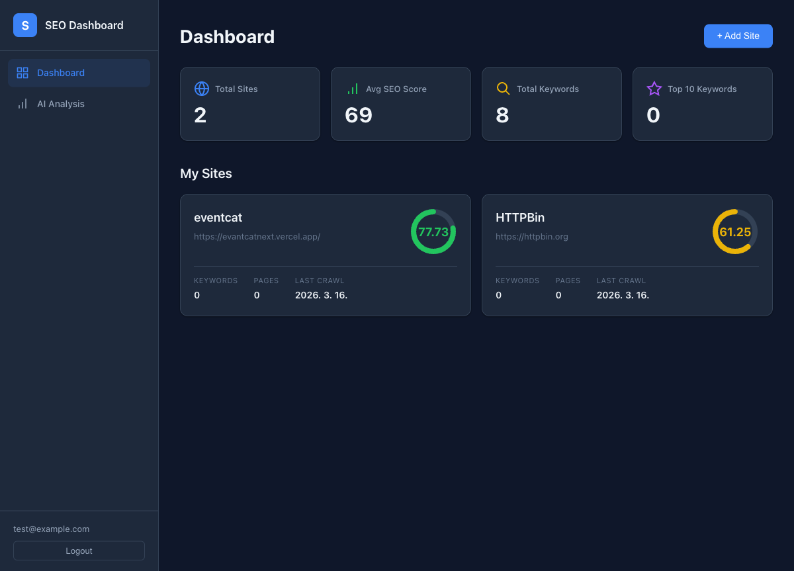

### 사이트 Overview
사이트별 SEO 점수, 크롤링 페이지 수, 평균 응답시간, 키워드 순위를 확인합니다.
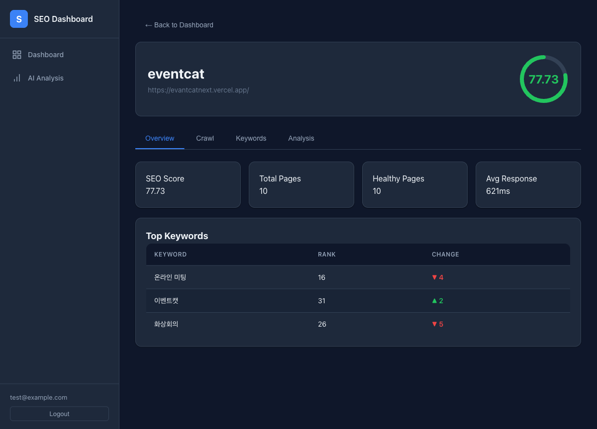

### 크롤링 관리
크롤링 작업을 시작하고 진행 상태를 확인합니다.
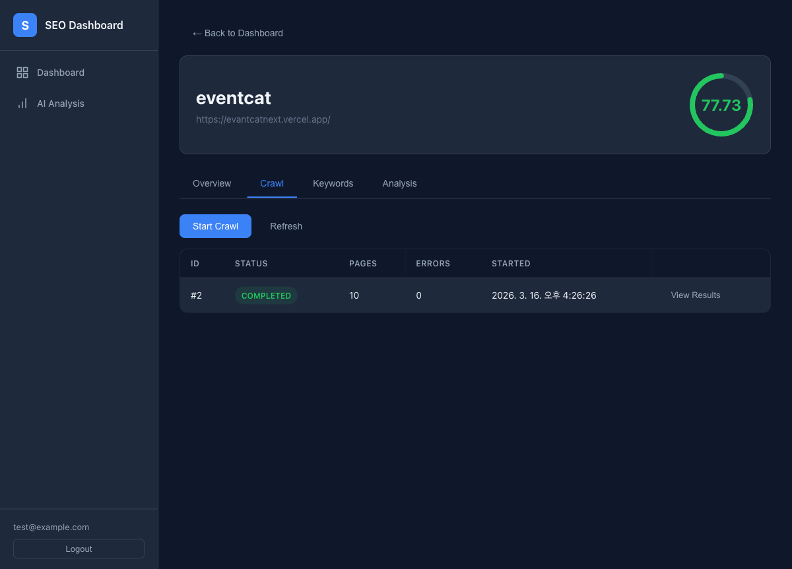

### 크롤링 결과
페이지별 SEO 점수, HTTP 상태코드, 응답시간을 테이블로 확인합니다.
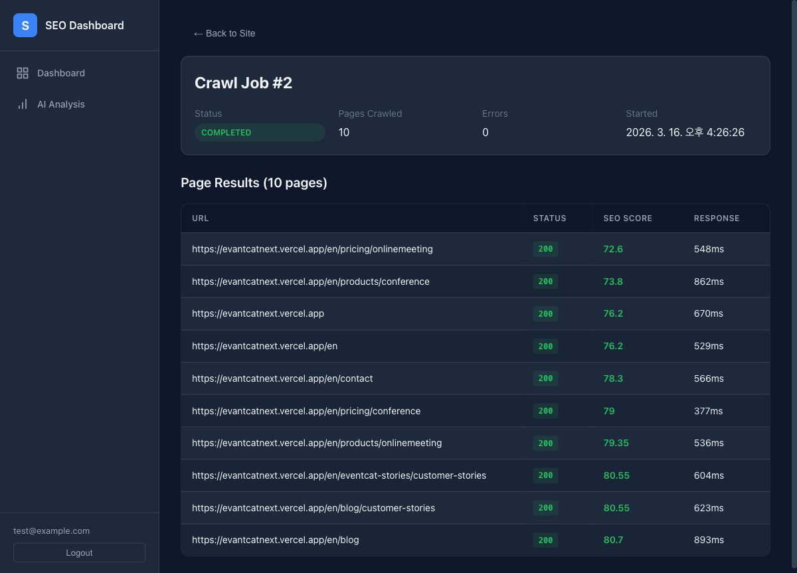

### 키워드 순위 추적
키워드별 검색 순위와 변동을 추적합니다. (▲ 상승, ▼ 하락)
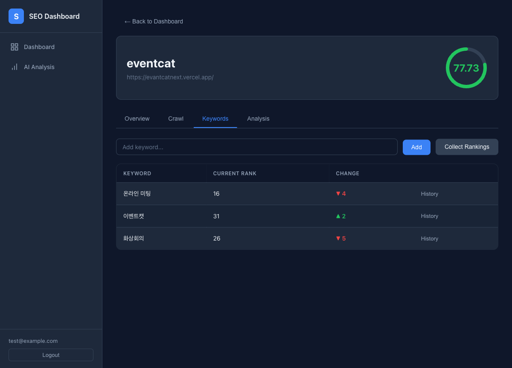

### AI 콘텐츠 분석 (사이트 내)
사이트 상세에서 콘텐츠를 입력하면 SEO 점수, 가독성을 분석합니다.
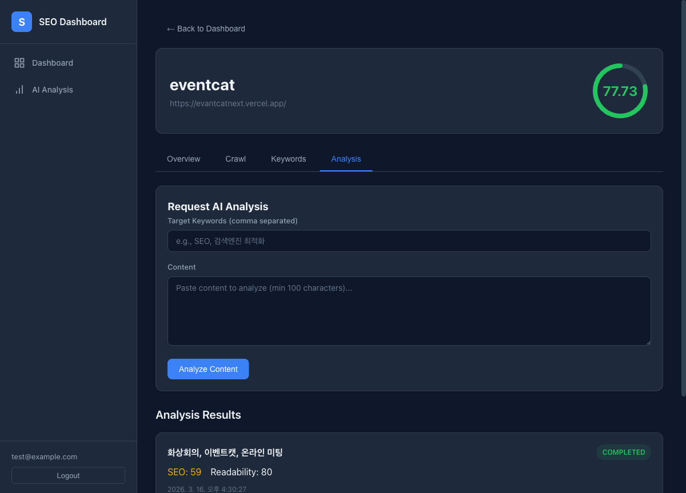

### 사이트 추가
대시보드에서 새 사이트를 등록합니다.
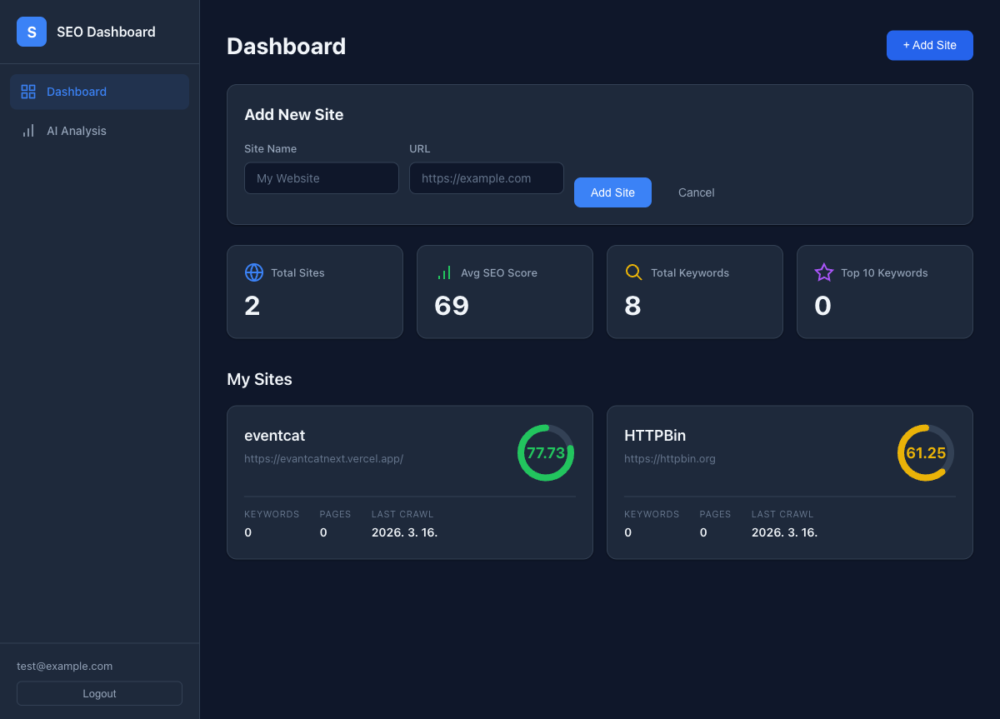

### 키워드 순위 이력 차트
키워드별 순위 변동을 Recharts 라인 차트로 시각화합니다.
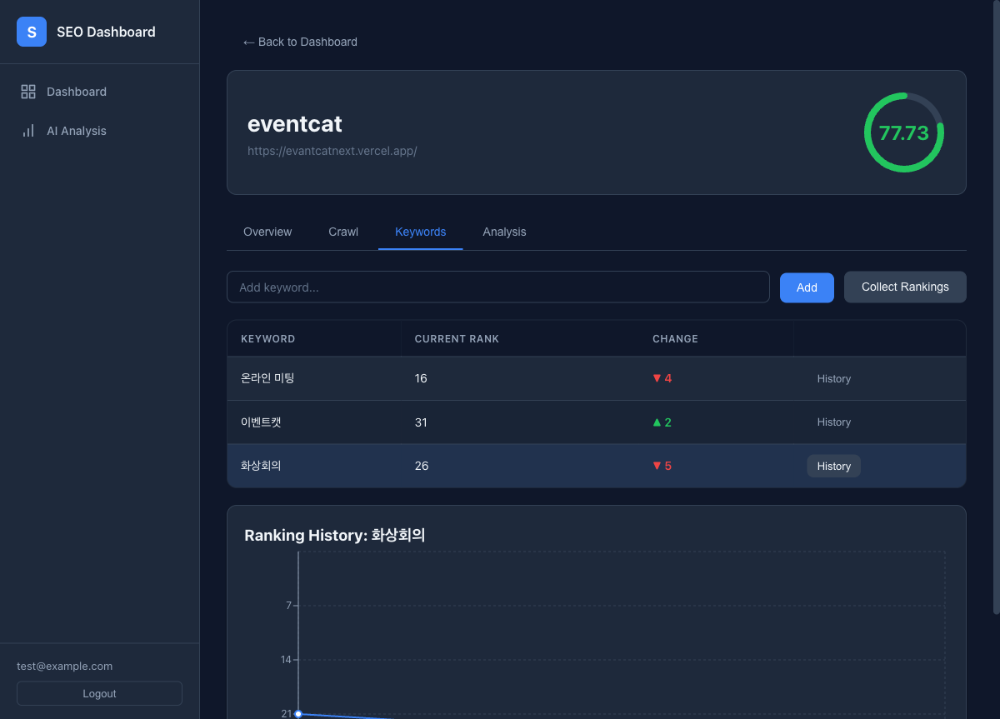

### AI Content Analysis 페이지
사이드바에서 접근하는 독립 AI 분석 페이지입니다.
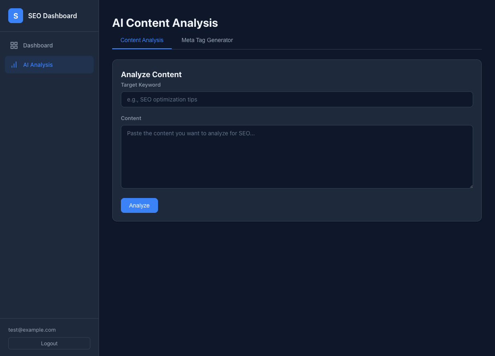

### Meta Tag Generator
AI가 메타 타이틀과 디스크립션을 자동 생성합니다.
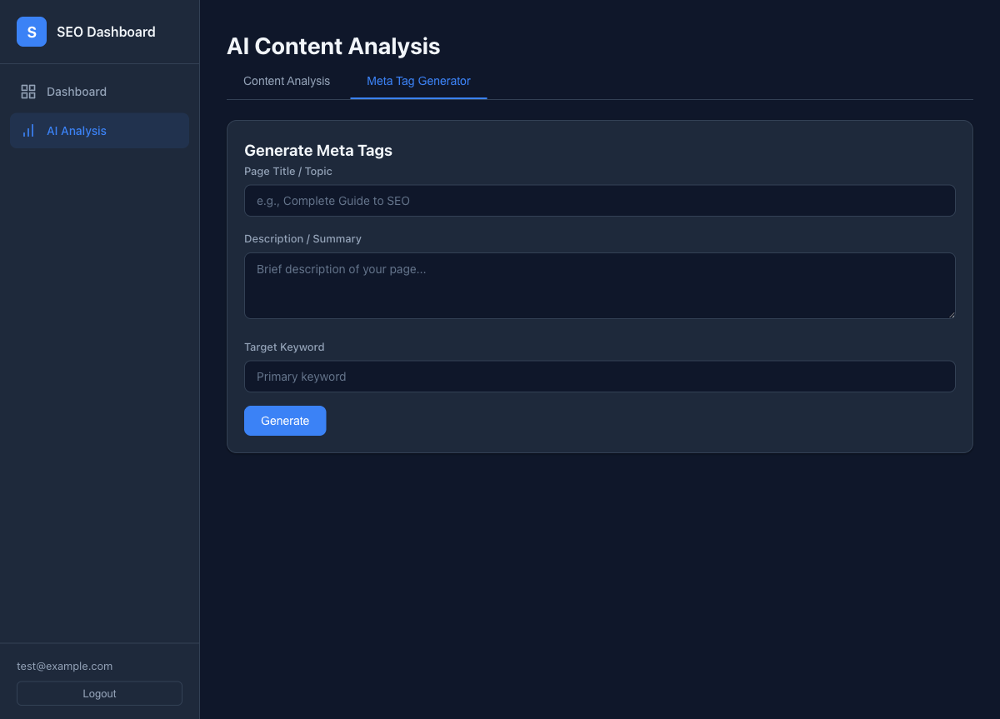

### Swagger API 문서
전체 36개 API 엔드포인트를 Swagger UI에서 확인하고 테스트할 수 있습니다.
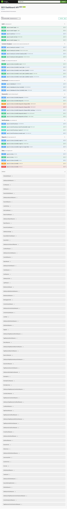

---

## 기술 스택

### Backend
| 기술 | 버전 | 용도 |
|------|------|------|
| **Java** | 21 | 메인 언어 |
| **Spring Boot** | 3.3.7 | 웹 프레임워크 |
| **Spring Security** | 6.x | JWT 인증/인가 |
| **Spring Data JPA** | 3.x | ORM, DB 접근 |
| **Spring Data Redis** | 3.x | 캐싱, 토큰 관리 |
| **PostgreSQL** | 15 | 메인 데이터베이스 |
| **Redis** | 7 | Refresh Token 저장 |
| **Jsoup** | 1.18.3 | HTML 파싱 (크롤러) |
| **JJWT** | 0.12.6 | JWT 생성/검증 |
| **Gradle** | Kotlin DSL | 빌드 도구 |

### Frontend
| 기술 | 용도 |
|------|------|
| **React** | UI 프레임워크 |
| **Vite** | 빌드 도구 |
| **React Router** | 페이지 라우팅 |
| **Recharts** | 순위 변동 차트 |

### Infrastructure
| 기술 | 용도 |
|------|------|
| **Docker Compose** | 로컬 개발 환경 (PostgreSQL + Redis) |
| **OrbStack** | macOS Docker 런타임 |

---

## 시스템 아키텍처

```
                        [React SPA]
                            |
                        [Spring Boot API]
                       /    |    |    \
              [Crawler] [Scheduler] [AI] [Common]
                  |         |        |
                  v         v        v
               [Kafka 이벤트 기반 비동기 처리]
                  |         |        |
            [PostgreSQL] [Redis] [AI API]
```

### 멀티모듈 구조
```
seo-dashboard/
├── seo-common/       # 공통 엔티티, DTO, 예외처리
├── seo-api/          # REST API, 인증, 컨트롤러
├── seo-crawler/      # 크롤링 엔진, SEO 분석기
├── seo-scheduler/    # 키워드 순위 수집
├── seo-ai/           # AI 콘텐츠 분석
├── frontend/         # React 대시보드
├── docker/           # Docker Compose 설정
└── docs/             # 설계 문서, 스크린샷
```

### 모듈 간 의존 관계
- `seo-common` : 독립 (다른 모듈에 의존 없음)
- `seo-api` → `seo-common`, `seo-crawler`, `seo-scheduler`, `seo-ai`
- `seo-crawler` → `seo-common`
- `seo-scheduler` → `seo-common`
- `seo-ai` → `seo-common`

모듈 간 통신은 **Spring Event + @Async** 기반 비동기 처리로 느슨하게 결합되어 있습니다.

---

## 핵심 기능

### 0. 공개 SEO 진단 (로그인 불필요)
- URL 입력만으로 즉시 SEO 분석 (로그인 없이 누구나 사용 가능)
- 종합 SEO 점수 (0~100)
- 메타태그 전체 수집 및 분석 (title, description, OG, Twitter Card 등)
- 체크리스트: HTTPS, OG 태그, Twitter Card, Viewport, Favicon, Robots.txt, Sitemap.xml
- 헤딩 구조 분석 (H1~H6)
- 링크 분석 (내부/외부/깨진 링크)
- 페이지 성능 (응답시간, 크기)
- SEO 이슈 및 개선 제안
- SEO 점수 순위표

### 1. 사이트 크롤링 & SEO 분석
- BFS 기반 사이트 전체 크롤링 (maxPages, maxDepth 설정 가능)
- robots.txt / sitemap.xml 존재 여부 체크
- 페이지별 6가지 SEO 항목 분석:

| 분석 항목 | 가중치 | 측정 기준 |
|----------|--------|----------|
| Title 태그 | 20% | 존재 여부, 길이 (30~60자 최적) |
| Meta Description | 15% | 존재 여부, 길이 (120~160자 최적) |
| Heading 구조 | 15% | H1 1개 존재, H2 사용, 계층 구조 |
| 이미지 최적화 | 15% | alt 속성 비율 |
| 링크 상태 | 15% | 깨진 링크 비율, 내부 링크 존재 |
| 페이지 성능 | 20% | 응답시간 기반 (< 500ms: 100점) |

### 2. 키워드 순위 추적
- 키워드 등록 (단건/일괄)
- 검색 순위 수집 (시뮬레이터 기반, 실제 SERP API 교체 가능)
- 순위 변동 추적 (▲ 상승, ▼ 하락)
- 기간별 순위 이력 조회 (7일/30일/90일)
- 트렌드 분석 (IMPROVING/DECLINING/STABLE)

### 3. AI 콘텐츠 최적화
- 콘텐츠 SEO 점수 산출 (키워드 밀도 30%, 가독성 25%, 콘텐츠 길이 20%, 구조 15%, 메타 10%)
- 키워드 밀도 분석 (LOW/OPTIMAL/HIGH)
- 가독성 점수 산출
- AI 기반 개선 제안 생성
- 메타 타이틀/디스크립션 자동 생성
- Strategy Pattern으로 AI 제공자 교체 가능 (Mock/OpenAI/Claude)

### 4. 대시보드 & 리포트
- 종합 대시보드 (전체 사이트 통계)
- 사이트별 대시보드 (SEO 점수, 이슈, 키워드 순위, 개선 우선순위)
- 주간/월간/커스텀 리포트 생성
- 알림 시스템 (읽음 처리, 심각도별 분류)

---

## API 엔드포인트 (41개)

### 공개 SEO 진단 (5개, 인증 불필요)
| Method | Endpoint | 설명 |
|--------|----------|------|
| POST | `/api/v1/public/analyze` | URL SEO 분석 (즉시 결과 반환) |
| GET | `/api/v1/public/analyze/{id}` | 분석 결과 조회 |
| GET | `/api/v1/public/recent` | 최근 분석 목록 (20개) |
| GET | `/api/v1/public/ranking` | SEO 점수 순위 (상위 50개) |
| GET | `/api/v1/public/domain/{domain}` | 도메인별 분석 이력 |

### 인증 (5개)
| Method | Endpoint | 설명 |
|--------|----------|------|
| POST | `/api/v1/auth/signup` | 회원가입 |
| POST | `/api/v1/auth/login` | 로그인 (JWT 발급) |
| POST | `/api/v1/auth/refresh` | 토큰 갱신 |
| POST | `/api/v1/auth/logout` | 로그아웃 |
| GET | `/api/v1/auth/me` | 내 정보 조회 |

### 사이트 (5개)
| Method | Endpoint | 설명 |
|--------|----------|------|
| POST | `/api/v1/sites` | 사이트 등록 |
| GET | `/api/v1/sites` | 사이트 목록 |
| GET | `/api/v1/sites/{siteId}` | 사이트 상세 |
| PUT | `/api/v1/sites/{siteId}` | 사이트 수정 |
| DELETE | `/api/v1/sites/{siteId}` | 사이트 삭제 |

### 크롤링 (5개)
| Method | Endpoint | 설명 |
|--------|----------|------|
| POST | `/api/v1/sites/{siteId}/crawl` | 크롤링 시작 |
| GET | `/api/v1/sites/{siteId}/crawl/jobs` | 크롤링 작업 목록 |
| GET | `/api/v1/sites/{siteId}/crawl/jobs/{jobId}` | 크롤링 상태 |
| POST | `/api/v1/sites/{siteId}/crawl/jobs/{jobId}/cancel` | 크롤링 취소 |
| GET | `/api/v1/sites/{siteId}/crawl/jobs/{jobId}/results` | 크롤링 결과 |

### 키워드 (7개)
| Method | Endpoint | 설명 |
|--------|----------|------|
| POST | `/api/v1/sites/{siteId}/keywords` | 키워드 등록 |
| POST | `/api/v1/sites/{siteId}/keywords/batch` | 키워드 일괄 등록 |
| GET | `/api/v1/sites/{siteId}/keywords` | 키워드 목록 |
| PUT | `/api/v1/sites/{siteId}/keywords/{keywordId}` | 키워드 수정 |
| DELETE | `/api/v1/sites/{siteId}/keywords/{keywordId}` | 키워드 삭제 |
| GET | `/api/v1/sites/{siteId}/keywords/{keywordId}/rankings` | 순위 이력 |
| POST | `/api/v1/sites/{siteId}/keywords/collect` | 순위 수집 |

### AI 분석 (4개)
| Method | Endpoint | 설명 |
|--------|----------|------|
| POST | `/api/v1/analysis/content` | 콘텐츠 분석 요청 (비동기) |
| GET | `/api/v1/analysis/content/{analysisId}` | 분석 결과 조회 |
| GET | `/api/v1/analysis/content` | 분석 목록 |
| POST | `/api/v1/analysis/meta-generate` | 메타 태그 생성 (동기) |

### 대시보드 (3개)
| Method | Endpoint | 설명 |
|--------|----------|------|
| GET | `/api/v1/dashboard` | 종합 대시보드 |
| GET | `/api/v1/dashboard/sites/{siteId}` | 사이트별 대시보드 |
| GET | `/api/v1/dashboard/sites/{siteId}/stats` | 사이트 통계 |

### 리포트 (3개)
| Method | Endpoint | 설명 |
|--------|----------|------|
| POST | `/api/v1/sites/{siteId}/reports` | 리포트 생성 |
| GET | `/api/v1/sites/{siteId}/reports` | 리포트 목록 |
| GET | `/api/v1/sites/{siteId}/reports/{reportId}` | 리포트 상세 |

### 알림 (4개)
| Method | Endpoint | 설명 |
|--------|----------|------|
| GET | `/api/v1/notifications` | 알림 목록 |
| GET | `/api/v1/notifications/unread-count` | 읽지 않은 수 |
| PATCH | `/api/v1/notifications/{notificationId}/read` | 읽음 처리 |
| PATCH | `/api/v1/notifications/read-all` | 일괄 읽음 |

---

## 데이터베이스 스키마

```
users (회원)
  ├── sites (등록 사이트) 1:N
  │     ├── crawl_jobs (크롤링 작업) 1:N
  │     │     └── crawl_results (크롤링 결과) 1:N
  │     │           └── page_analyses (페이지 SEO 분석) 1:1
  │     ├── keywords (키워드) 1:N
  │     │     └── keyword_rankings (순위 이력) 1:N
  │     └── reports (리포트) 1:N
  ├── content_analyses (AI 분석) 1:N
  └── notifications (알림) 1:N
```

총 10개 테이블, JSONB 컬럼 활용 (issues, suggestions, keyword_density, summary 등)

---

## 실행 방법

### 사전 요구사항
- Java 21
- Node.js 18+
- Docker (OrbStack 또는 Docker Desktop)

### 1. 저장소 클론
```bash
git clone <repository-url>
cd seo-dashboard
```

### 2. Docker로 DB + Redis 실행
```bash
cd docker
docker-compose up -d
cd ..
```

### 3. 백엔드 실행
```bash
./gradlew :seo-api:bootRun --args='--spring.profiles.active=local'
```
백엔드: http://localhost:8080

### 4. 프론트엔드 실행
```bash
cd frontend
npm install
npm run dev
```
프론트엔드: http://localhost:3001

### 5. 접속
- 대시보드: http://localhost:3001
- Swagger API 문서: http://localhost:8080/swagger-ui/index.html
- 회원가입 후 사용

---

## 사용 방법

### Step 1: 회원가입 & 로그인
1. http://localhost:3001 접속
2. Sign Up 탭에서 이메일/비밀번호/이름 입력 → 가입
3. 자동으로 대시보드로 이동

### Step 2: 사이트 등록
1. Dashboard에서 **+ Add Site** 클릭
2. 사이트 이름, URL 입력 → Add

### Step 3: 크롤링
1. 사이트 카드 클릭 → **Crawl** 탭
2. **Start Crawl** 클릭
3. 20~30초 후 **Refresh** → 결과 확인
4. **View Results**로 페이지별 SEO 점수 확인

### Step 4: 키워드 추적
1. **Keywords** 탭에서 키워드 입력 → **Add**
2. **Collect Rankings** 클릭 → 순위 수집
3. 여러 번 수집하면 순위 변동(▲▼) 확인 가능
4. **History** 버튼으로 순위 이력 차트 확인

### Step 5: AI 콘텐츠 분석
1. **Analysis** 탭에서 타겟 키워드 입력
2. 분석할 콘텐츠 붙여넣기 (최소 100자)
3. **Analyze Content** 클릭
4. 3~5초 후 SEO 점수, 가독성, 개선 제안 확인

---

## 프로젝트 구조 상세

```
seo-dashboard/
├── build.gradle.kts              # 루트 빌드 (공통 플러그인, BOM)
├── settings.gradle.kts           # 멀티모듈 설정
├── gradle.properties             # 버전 프로퍼티
│
├── seo-common/                   # 공통 모듈
│   └── src/main/java/com/seodashboard/common/
│       ├── domain/               # JPA 엔티티 (User, Site, CrawlJob, Keyword 등)
│       ├── dto/                  # 공통 DTO (ApiResponse, PageResponse, ErrorResponse)
│       ├── exception/            # 예외 처리 (ErrorCode, BusinessException, GlobalExceptionHandler)
│       └── config/               # JPA Auditing, Jackson 설정
│
├── seo-api/                      # API 모듈
│   └── src/main/java/com/seodashboard/api/
│       ├── auth/                 # 인증 (JWT, Security, AuthController)
│       ├── site/                 # 사이트 CRUD
│       ├── crawl/                # 크롤링 API + 이벤트
│       ├── keyword/              # 키워드 API
│       ├── analysis/             # AI 분석 API + 이벤트
│       ├── dashboard/            # 대시보드 API
│       ├── report/               # 리포트 API
│       ├── notification/         # 알림 API
│       └── config/               # Security, CORS, Redis, Swagger
│
├── seo-crawler/                  # 크롤러 모듈
│   └── src/main/java/com/seodashboard/crawler/
│       ├── engine/               # CrawlEngine (BFS), PageFetcher, HtmlParser
│       ├── analyzer/             # SEO 분석기 6종 (Meta, Heading, Image, Link, Performance, 통합)
│       ├── service/              # CrawlExecutionService (비동기 실행)
│       └── config/               # AsyncConfig, CrawlerProperties
│
├── seo-scheduler/                # 스케줄러 모듈
│   └── src/main/java/com/seodashboard/scheduler/
│       └── service/              # KeywordRankingCollector, RankingSimulator
│
├── seo-ai/                       # AI 모듈
│   └── src/main/java/com/seodashboard/ai/
│       ├── client/               # AiClient (Strategy Pattern), MockAiClient
│       ├── service/              # KeywordDensity, Readability, SeoContentScorer, Executor
│       └── dto/                  # AiAnalysisResult, ContentSuggestion, MetaSuggestion
│
├── frontend/                     # React 프론트엔드
│   └── src/
│       ├── api/client.js         # API 클라이언트 (JWT 자동 첨부)
│       ├── context/AuthContext.jsx
│       ├── components/           # Layout, Sidebar, ScoreCard, SiteCard
│       └── pages/                # Login, Dashboard, SiteDetail, CrawlResult, Analysis
│
├── docker/
│   └── docker-compose.yml        # PostgreSQL 15 + Redis 7
│
└── docs/
    ├── architecture.md           # 시스템 아키텍처 설계
    ├── database-schema.md        # DB 스키마 설계
    ├── api-spec.md               # API 명세
    └── screenshots/              # UI 스크린샷
```

---

## 주요 설계 결정

### 비동기 처리
크롤링과 AI 분석은 시간이 오래 걸리므로 비동기로 처리합니다.
- API는 즉시 `202 Accepted` 반환
- `@TransactionalEventListener(AFTER_COMMIT)` + `@Async`로 트랜잭션 커밋 후 백그라운드 실행
- 클라이언트는 상태 폴링으로 결과 확인

### JWT 인증
- Access Token: 30분 (HS512)
- Refresh Token: 14일 (Redis 저장)
- `JwtAuthenticationFilter`에서 모든 요청의 토큰 검증

### AI Strategy Pattern
```java
public interface AiClient {
    AiAnalysisResult analyzeContent(String content, List<String> targetKeywords);
    List<MetaSuggestion> generateMeta(String content, List<String> targetKeywords, int count);
}
```
- `MockAiClient`: API 키 없이 동작하는 기본 구현체 (규칙 기반)
- `application.yml`의 `ai.provider` 설정으로 교체 가능

### JSONB 활용
유동적인 구조의 데이터는 PostgreSQL JSONB로 저장:
- `page_analyses.issues`: SEO 이슈 목록
- `page_analyses.heading_structure`: 헤딩 구조
- `content_analyses.keyword_density`: 키워드 밀도 분석
- `content_analyses.suggestions`: AI 개선 제안
- `reports.summary`: 리포트 요약 데이터

---

## 개발 과정

| Phase | 기간 | 구현 내용 |
|-------|------|----------|
| **Phase 1** | 설계 + 기반 | 시스템 아키텍처, DB 스키마, API 설계 → 멀티모듈 프로젝트, JWT 인증, 사이트 CRUD |
| **Phase 2** | 크롤러 | BFS 크롤링 엔진, 6종 SEO 분석기, 비동기 처리, 크롤링 API |
| **Phase 3** | 키워드 | 키워드 CRUD, 순위 수집 (시뮬레이터), 순위 이력, 트렌드 분석 |
| **Phase 4** | AI 분석 | 콘텐츠 분석, 키워드 밀도/가독성 분석, 메타 생성, Strategy Pattern |
| **Phase 5** | 대시보드 | 종합/사이트별 대시보드, 리포트, 알림 시스템 |
| **Frontend** | UI | React 다크 테마 대시보드, 차트, 실시간 데이터 표시 |

---

## 환경 설정

### application.yml 주요 설정
```yaml
# DB
spring.datasource.url: jdbc:postgresql://localhost:5432/seo_dashboard
spring.datasource.username: seo_user
spring.datasource.password: seo_password

# Redis
spring.data.redis.host: localhost
spring.data.redis.port: 6379

# JWT
jwt.secret: (환경변수로 오버라이드 가능)
jwt.access-token-expiration: 1800000   # 30분
jwt.refresh-token-expiration: 1209600000  # 14일

# 크롤러
crawler.max-concurrent-requests: 5
crawler.request-timeout-ms: 10000
crawler.delay-between-requests-ms: 200

# AI
ai.provider: mock  # mock | openai | claude
```

### Docker Compose
```yaml
services:
  postgres:   # PostgreSQL 15, port 5432
  redis:      # Redis 7, port 6379
```

---

## 향후 개선사항

- [ ] 실제 Google SERP API 연동 (키워드 순위)
- [ ] OpenAI/Claude API 연동 (AI 분석)
- [ ] Kafka 도입 (모듈 간 메시지 큐)
- [ ] TimescaleDB 적용 (시계열 데이터 최적화)
- [ ] WebSocket 실시간 알림
- [ ] Docker 통합 배포 (Dockerfile + 전체 docker-compose)
- [ ] GitHub Actions CI/CD
- [ ] 테스트 코드 (목표 80%+ 커버리지)
- [ ] Prometheus + Grafana 모니터링
- [ ] PDF 리포트 생성 (MinIO + PDF 라이브러리)
